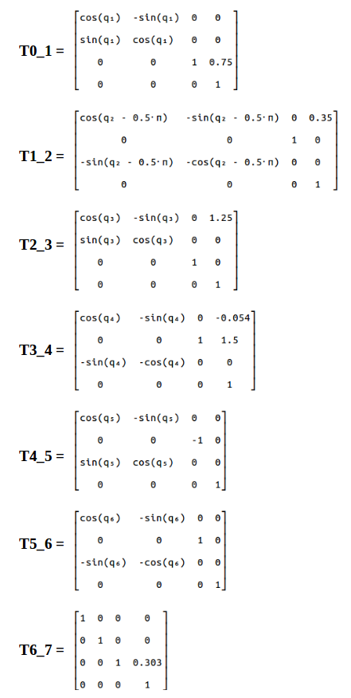

## Project: Kinematics Pick & Place

[//]: # (Image References)

[image1]: ./misc_images/forward_kinematics.JPG
[image2]: ./misc_images/RoboND_Kitnamics_Sketch_BK.jpg
[image3]: ./misc_images/kinematics_analysis_WC.jpg
[image4]: ./misc_images/ik_equations_BK.JPG
[image5]: ./misc_images/works_BK1.JPG
[image6]: ./misc_images/works_BK2.JPG
[image7]: ./misc_images/error_BK.JPG

## [Rubric](https://review.udacity.com/#!/rubrics/972/view) Points
### Here I will consider the rubric points individually and describe how I addressed each point in my implementation.  

---

### Kinematic Analysis
#### 1. Run the forward_kinematics demo and evaluate the kr210.urdf.xacro file to perform kinematic analysis of Kuka KR210 robot and derive its DH parameters.

From the URDF file `kr210.urdf.xacro` we can extract the position xyz and orientation rpy of each joint from **origin** tag in each joint XML section, and following table is showing complete extracted list for all joints base to gripper:

O | joint | parent | child | x | y | z | r | p | y |
--- | --- | --- | --- | --- | --- | --- | --- | --- | --- |
0 | fixed_base | base_footprint | base_link | 0 | 0 | 0 | 0 | 0 | 0 |
1 | joint_1 | base_link | link_1 | 0 | 0 | 0.33 | 0 | 0 | 0 |
2 | joint_2 | link_1 | link_2 | 0 .35| 0 | 0.42 | 0 | 0 | 0 |
3 | joint_3 | link_2 | link_3 | 0 | 0 | 1.25 | 0 | 0 | 0 |
4 | joint_4 | link_3 | link_4 | 0.96 | 0 | -0.054 | 0 | 0 | 0 |
5 | joint_5 | link_4 | link_5 | 0.54 | 0 | 0 | 0 | 0 | 0 |
6 | joint_6 | link_5 | link_6 | 0.193 | 0 | 0 | 0 | 0 | 0 |
7 | gripper | link_6 | gripper_link | 0.11 | 0 | 0 | 0 | 0 | 0 |
. | **Total (m)** |  |  | **2.153** | 0 | **1.946** | 0 | 0 | 0 |


The kinematic sketch (Figure 2) was generated by using the forward_kinematics.launch file with assistance from Lesson 2 and Project Module.

![alt text][image1]

###### **Figure**  **1** : Model represented by the foward_kinematics.launch file

![alt text][image2]
###### **Figure**  **2** : Sketch to display links with offsets, lengths, and joint axes.


#### 2. Using the DH parameter table you derived earlier, create individual transformation matrices about each joint. In addition, also generate a generalized homogeneous transform between base_link and gripper_link using only end-effector(gripper) pose.

Obtained the DH Parameters performing a kinematic sketch (Figure 2) and analysis like the one explained in Lesson 2 and later in the Project Module.

The same structure for deriving transforms in FK.py was used in IK_server.py. To avoid repetition and typos, a generic DH transform function was created so individual joint symbol sets could be substituted in for evaluation. Using the kr210.urdf.xacro file the below DH Parameter table was generated. Values were obtained by looking for the joints section in the xacro file; there using the sketch from Figure 2 distances from joint to joint were obtained and used as a(i-1) and d(i) values repective to their axis as provided in the Figure. Some values, like d(EE) might need to obtained by the sum of multiple joint xyz values, in this case, the x value of joint 6 and the x value of the gripper joint.


Links | alpha(i-1) | a(i-1) | d(i) | theta(i)
--- | --- | --- | --- | ---
0->1 | 0 | 0 | 0.75 | q1
1->2 | - pi/2 | 0.35 | 0 | -pi/2 + q2
2->3 | 0 | 1.25 | 0 | q3
3->4 | - pi/2 | - 0.054 | 1.5 | q4
4->5 |   pi/2 | 0 | 0 | q5
5->6 | - pi/2 | 0 | 0 | q6
6->EE | 0 | 0 | 0.303 | 0

##### Creating the individual transformation matrices about each joint:

Using above DH parameter table, we can create individual transforms between various links. DH convention uses four individual transforms: 

<p align="center">  </p>

Using the DH parameter table, we can transform from one frame to another using the following matrix:

<p align="center">  </p>

Python code for a function that will return the individual frame transformation matrix is as following:

```python
# Function to return homogeneous transform matrix

def TF_Mat(alpha, a, d, q):
    TF = Matrix([[            cos(q),           -sin(q),           0,             a],
                 [ sin(q)*cos(alpha), cos(q)*cos(alpha), -sin(alpha), -sin(alpha)*d],
                 [ sin(q)*sin(alpha), cos(q)*sin(alpha),  cos(alpha),  cos(alpha)*d],
                 [                 0,                 0,           0,             1]])
    return TF
    
```

Individual transform matrices about each joint using the DH table are as following:


<p align="center">  </p>

#### 3. Decouple Inverse Kinematics problem into Inverse Position Kinematics and inverse Orientation Kinematics; doing so derive the equations to calculate all individual joint angles.

The Inverse Position Kinematics were addressed in this snippet from the [IK_debug.py]:

	            # Compensate for rotation discrepancy between DH parameters and Gazebo
            Rot_rpy = Rot_rpy.evalf(subs={r: roll, p: pitch, y: yaw})
            Rot_EE = Rot_rpy * Rot_corr

            # Calculate joint angles using Geometric IK method
            EE = Matrix([[px],
                         [py],
                         [pz]])

            WC = EE - (0.303) * Rot_EE[:, 2]

            #d_7 = dh[d7]
            wx = WC[0] #px - (d_7 * Rot_EE[0,2])
            wy = WC[1] #py - (d_7 * Rot_EE[1,2])
            wz = WC[2] #pz - (d_7 * Rot_EE[2,2])

The Inverse Orientation Kinematics were addressed by the analysis shown in the following figures:

![alt text][image3]

###### **Figure**  **3**: Representation of the triangle made up by joints 2, 3 and wrist center.

![alt text][image4]

###### **Figure**  **4**: Triangle 2-3-WC with equations used


The following code shows the way the above equations were addressed to obtain theta 1-6.

	# Leveraging link distances and offsets from dh table
	a_3 = dh[a3]
	d_4 = dh[d4]
	d_1 = dh[d1]
	a_1 = dh[a1]
	a_2 = dh[a2]

	#### Finding theta 1-3
	theta1 = atan2(wy, wx)

	# equations from the inverse kinematics example (Kinematics: lesson 2 - Section 19)
	r = sqrt(wx**2 + wy**2) - a_1 #wx -> xc & wy -> yc (interpreted from top view)
	S = wz - d_1 # wz -> zc

	s_a = sqrt(a_3**2 + d_4**2)
	s_b = sqrt(r**2 + S**2)
	s_c = a_2

	# Law of Cosines to obtain angles a and b (alpha and beta, respectively)
	alpha = acos((s_c**2 + s_b**2 - s_a**2) / (2*s_c*s_b))
	beta = acos((s_c**2 + s_a**2 - s_b**2) / (2*s_c*s_a))

	theta2 = (pi/2) - alpha - atan2(S,r)
	theta3 = (pi/2) - beta - atan2(-a_3,d_4)

	#### Finding theta 4-6

	# Evaluating rotational matrix extracted from original transformation matrices using obtained theta_i
	R0_3 = T0_1 * T1_2 * T2_3
	R0_3 = R0_3[0:3, 0:3]
	R0_3 = R0_3.evalf(subs={q1: theta1, q2: theta2, q3: theta3})

	R3_6 = R0_3.inv("ADJ") * R0_6 # noticed ADJ inverse method reduced EE position error to 0 on IK_debug.py
	
	# R3_6 Matrix Values
	r13 = R3_6[0,2]
	r33 = R3_6[2,2]
	r23 = R3_6[1,2]
	r21 = R3_6[1,0]
	r22 = R3_6[1,1]
	r12 = R3_6[0,1]
	r32 = R3_6[2,1]

	theta4 = atan2(r33, -r13)
	theta5 = atan2(sqrt(r13**2 + r33**2), r23)
	theta6 = atan2(-r22, r21)

The matrix displayed in Figure 4 further demonstrate the way rotational matrix values were extracted.


### Project Implementation

#### 1. Fill in the `IK_server.py` file with properly commented python code for calculating Inverse Kinematics based on previously performed Kinematic Analysis. Your code must guide the robot to successfully complete 8/10 pick and place cycles. Briefly discuss the code you implemented and your results. 


In order to obtain the transformation and rotation matrices, all of the different matrices have been generated by utilizing functions. All the functions are shown in the [IK_srver.py] below:


	def TF_Matrix(q, alpha, a, d):
		T = Matrix([[           cos(q),           -sin(q),           0,             a],
					[sin(q)*cos(alpha), cos(q)*cos(alpha), -sin(alpha), -sin(alpha)*d],
					[sin(q)*sin(alpha), cos(q)*sin(alpha),  cos(alpha),  cos(alpha)*d],
					[                0,                 0,           0,             1]])
		return(T)

	def Get_R_z(y):
		Rot_z = Matrix([[   cos(y),   -sin(y),         0],
						[   sin(y),    cos(y),         0],
						[        0,         0,         1]])
		return(Rot_z)

	def Get_R_y(p):
		Rot_y = Matrix([[   cos(p),         0,    sin(p)],
						[        0,         1,         0],
						[  -sin(p),         0,    cos(p)]])
	
		return(Rot_y)

	def Get_R_x(r):
		Rot_x = Matrix([[        1,         0,         0],
						[        0,    cos(r),   -sin(r)],
						[        0,    sin(r),    cos(r)]])
		return(Rot_x)

		

These allowed the code to easily create the many transformation and rotation matrices by calling the functions, while still being outside of the handle_calculate_IK function. Another advantage was to generate all the transformation and rotation matrices outside the forloop to prevent them being generated constantly which would decrease performance and effectiveness. Further, I tried to leverage the DH parameters as much as possible given that they were already created and stored.

Possibly, due to computer performance, it was rather slow still and while I tried implementing a class structure to the code, I couldn't manage to get it to work.

![alt text][image5]

###### **Figure**  **5** : Here it shows the gripper grabbing the can on the shelf

![alt text][image6]

###### **Figure**  **6** : Here it shows the kuka arm releasing the can on the bucket.


2. Errors and considerations for future improvements.
While debugging the code many times (long times due to slow performance), the code does not respond well when the planned path is relatively abnormal and navitates far away to grab a can or to move towards the bucket. Not sure why this happens but when normal trajectories are given the code performs well. Not sure if it'll require calibration or more statements to make it smarter and discern the correct path to take on that kind of situation. 


![alt text][image7]

###### **Figure**  **7** : Here it shows the error given when abnormal planned path is provided and it's unable to solve the inverse kinematics.

After reading the Slack channel, I learned that simplify functions were removed to speed up the loop performance. Furthermore, keeping symbolic representations was unnecessary and equations containing symbols were evaluated numerically as early in the loop as possible to avoid carrying symbols forward due to all outputs of interest were numerical. This significantly reduced the inverse kinematic calculation times (from minutes to seconds). 


Future improvements:

All the belows could be investigated to improve pickup performance:

1) there are extraneous symbols defined in the DH parameter dictionary which are not used in the inverse kinematics calculations and can be removed.

2) A minor initialization speed improvement would be to hardcode the calculated maxtrices than recalculating them each time IK_server.py is run. 

3) Occasionally, the gripper would appear to be in the correct location in front of the target at the end of the IK movement, but the following automatic "reach" step would back it out of position, execute a waving motion, and knock over the target rather than reaching forward directly for it. 

### Recorded Test video

The full testing video after implementing all above mentioned steps is uploaded on YouTube on the following link:

[](http://www.youtube.com/watch?v=PVhC8Xx4VF0)
